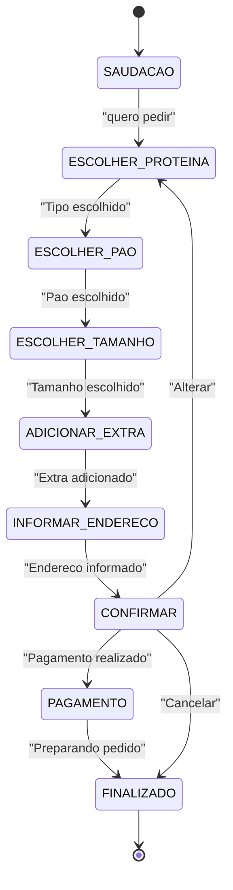

#  SanduBot – Chatbot baseado em Autômato Finito para Pedidos de Sanduíche

Este projeto implementa um **chatbot simples** usando um **Autômato Finito Determinístico (AFD)** para realizar pedidos de sanduíches pelo terminal.  
O objetivo é demonstrar na prática como autômatos podem ser utilizados para **controlar fluxos de diálogo estruturados**, garantindo que o usuário siga as etapas corretas de um pedido.

---

##  Conceito do Projeto

O chatbot funciona como um **Autômato Finito**, onde cada estado representa uma etapa do pedido:

1. Saudação  
2. Escolha do tipo do sanduíche  
3. Tipo de pão  
4. Tamanho  
5. Extras  
6. Endereço  
7. Confirmação  
8. Pagamento  
9. Finalização

O usuário navega pelo fluxo conforme suas respostas, e o autômato controla todas as transições.

---

# Diagrama de Estados (Mermaid)

---
# Tabela de estados e transições

| **Estado Atual**      | **Entrada do Usuário**                                  | **Próximo Estado** | **Ação do Sistema**      |
| --------------------- | ------------------------------------------------------- | ------------------ | ------------------------ |
| **SAUDACAO**          | dizer "quero pedir"                                     | ESCOLHER_PROTEINA  | Pede para iniciar pedido |
| **ESCOLHER_SABOR**    | sabor válido (cheeseburger, frango, veggie, x-salada)   | ESCOLHER_TAMANHO   | Pergunta qual carne      |
| **ESCOLHER_TAMANHO**  | tamanho válido (pequena, média, media, grande)          | ESCOLHER_BEBIDA    | Pergunta tamanho         |
| **INFORMAR_ENDERECO** | texto com mais de 5 caracteres                          | CONFIRMAR          | Mostra resumo            |
| **CONFIRMAR**         | "confirmar"                                             | PAGAMENTO          | Pergunta pagamento       |
| **PAGAMENTO**         | "dinheiro", "cartão"                                    | FINALIZADO         | Finaliza pedido          |
| **FINALIZADO**        | —                                                       | —                  | Mostra pedido e encerra  |
| **CANCELADO**         | —                                                       | FINALIZADO         | Cancela e encerra        |
